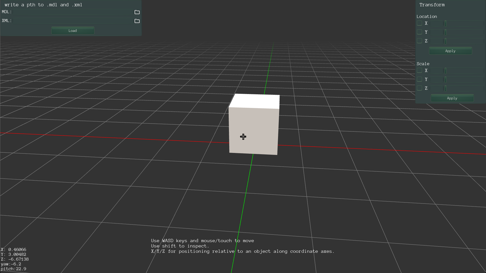

# ModelsViewer

A 3D model viewer built with Urho3D engine. Currently supports loading `.mdl` models with `.xml` material files, positioning objects in 3D space, and scaling them along each axis. More features are planned.

**Current features:**
- Load `.mdl` models and apply `.xml` materials via file browser
- Move objects along X / Y / Z axes with sliders (supports negative direction)
- Scale objects along each axis independently
- Apply position and scale via text input fields
- Three-point lighting setup
- Orbit camera with mouse, WASD movement, scroll zoom
- Grid with highlighted X (red) and Z (green) axes


---

## About Urho3D

[Urho3D](https://github.com/urho3d/Urho3D) is a free, lightweight, cross-platform 2D and 3D game engine implemented in C++. It supports Direct3D11/OpenGL rendering, a full scene graph, physics, UI, audio, networking, and scripting. The engine is entirely open-source under the MIT license and is well suited for learning low-level game development without the abstraction layers of larger engines like Unity or Unreal.

---

## Requirements

- Windows 10/11
- Visual Studio 2022
- CMake 3.14 or newer
- Urho3D SDK (built from source or pre-built)

---

## Building from source

### 1. Build and install the Urho3D SDK

Clone and build Urho3D. The easiest path on Windows:

```bash
git clone https://github.com/urho3d/Urho3D.git
cd Urho3D
cmake -B build -DURHO3D_D3D11=ON -DURHO3D_SAMPLES=OFF -DCMAKE_INSTALL_PREFIX=C:/Urho3D-SDK
cmake --build build --config Release
cmake --install build --config Release
```

After this you should have a folder like `C:/Urho3D-SDK` containing `include/`, `lib/`, and `share/`.

### 2. Clone this repository

```bash
git clone https://github.com/YOUR_USERNAME/ModelsViewer.git
cd ModelsViewer
```

### 3. Configure with CMake

Pass your Urho3D SDK path via `-DURHO3D_HOME`:

```bash
cmake -B build -DURHO3D_HOME=C:/Urho3D-SDK
```

Or set the `URHO3D_HOME` environment variable once and just run:

```bash
cmake -B build
```

### 4. Open in Visual Studio and build

```bash
start build/ModelsViewer.sln
```

Select **Release** configuration and press **Ctrl+F5** to build and run.

The executable will appear in `build/Release/ModelsViewer.exe` alongside the required `Data/` and `CoreData/` folders.

---

## Running without building

Download the latest release from the [Releases](../../releases) page, extract the zip, and run `ModelsViewer.exe`. No installation required.


